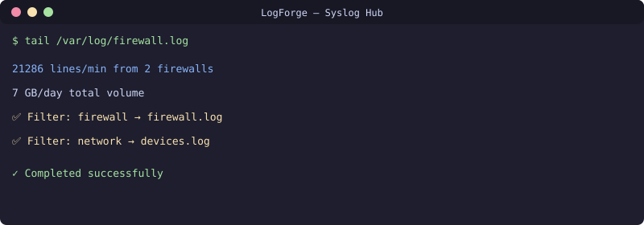

<div align="center">

**🇬🇧 [English](README.md) · 🇷🇺 [Русский](README.ru.md) · 🇺🇿 [Oʻzbekcha](README.uz.md)**

</div>

# Smart Syslog Hub
[](https://github.com/uMax-Cyber/LogForge/actions/workflows/ci.yml)



Centralized syslog receiver with intelligent filtering for multi-vendor networks. Routes logs by source device type (firewalls vs network gear vs servers), handles multi-interface firewall source IPs, and includes rotation policies tuned for high-volume environments.

## Architecture

```
Firewalls (multi-interface) ──┐
Network switches/APs ─────────┤──▶ rsyslog (UDP 514) ──▶ Per-source log files
Linux servers ────────────────┘         │
                                        ▼
                                  Logrotate (per-source policy)
```

## Key Gotchas (from real deployment)

### 1. Multi-Interface Firewalls Source from Egress IP
A firewall with 10+ interfaces may source syslog from its LAN egress IP, NOT its management IP. Your filter for "management IP" will silently miss all firewall logs.

**Fix**: Sniff actual source IPs before writing filters. Add all known interface IPs.

### 2. File Permissions (Silent Failure)
rsyslog runs as user `syslog`, not root. If log files are owned `root:root`, you get silent `Permission denied` in rsyslog's own log while network logs are dropped.

**Fix**: `chown syslog:adm /var/log/network.log`

### 3. Filter Order Matters
A broad filter (`startswith "10.0.0."`) loaded before a specific filter (`isequal "10.0.0.254"`) will steal the specific device's logs.

**Fix**: Name config files so specific filters load first (59-firewall.conf before 60-network.conf).

### 4. Volume Planning
A single firewall logging "Allowed" sessions can generate **21,000 lines/minute** (~7 GB/day). Plan logrotate accordingly.

## Config Files

- `config/59-firewall.conf` — Specific IP filters (load FIRST)
- `config/60-network-devices.conf` — Broad network device filter
- `config/logrotate-firewall` — Aggressive rotation for high-volume firewall logs

## License
MIT
